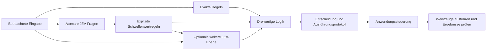

# jev-gates

[English](README.md) · [繁體中文](README.zh-TW.md) · [简体中文](README.zh-CN.md) · [日本語](README.ja.md) · [한국어](README.ko.md) · [Español](README.es.md) · [Français](README.fr.md) · **Deutsch** · [Português (Brasil)](README.pt-BR.md)

**Komplexe Entscheidungen aus kleinen semantischen Bewertungen zusammensetzen.**

JEV beantwortet gezielte Fragen. `jev-gates` wandelt diese Antworten in explizite Signale mit den Werten `TRUE`, `FALSE` oder `UNKNOWN` um und verknüpft sie mit gewöhnlichen logischen Operationen. Definiere eine Schaltung als JSON, verwende sie in einer größeren Schaltung wieder oder übergib frühere Signale an eine zweite semantische Ebene.

[Schaltungsreferenz](docs/circuits.md) · [Architektur](docs/architecture.md) · [Leitfaden zur Evaluation](docs/evaluation.md)

Die hier verlinkte ausführliche technische Dokumentation ist derzeit auf Englisch verfügbar.

Version 0.1.0. TypeScript, Node.js 22+, keine Laufzeitabhängigkeiten, MIT. Dieses unabhängige, inoffizielle Projekt wird weder von TypeSafe AI gepflegt noch unterstützt. Der Quellcode lässt sich lokal ausführen; diese Anleitung setzt keine Veröffentlichung auf npm voraus.



## Offline-Demo ausführen

Klone das Repository oder verwende deine vorhandene Arbeitskopie:

```sh
git clone https://github.com/carlchou0dailyfresh/jev-gates.git
cd jev-gates
npm install
npm test
npm run demo
```

Die Demo nutzt **von Hand erstellte simulierte Antworten**, sendet keine Inferenzanfragen und gibt `priority_queue: TRUE` zurück. Sie demonstriert folgenden Ausdruck:

```text
enterprise AND (urgent OR billing) AND NOT abuse
```

`enterprise` ist ein exakter Feldvergleich. `urgent`, `billing` und `abuse` sind semantische Fragen. Die Empfehlung versendet keine Nachricht und verändert keine Support-Warteschlange.

```sh
node dist/cli.js validate examples/support-triage.json
node dist/cli.js graph examples/support-triage.json
node dist/cli.js run examples/layered-review.json \
  --input examples/layered-input.json \
  --mock examples/layered-answers.json \
  --trace /tmp/jev-layered-trace.json
```

Das mehrstufige Beispiel kombiniert eine Bewertung, eine Themenauswahl und eine exakte Eignungsprüfung. Ergibt das Vorauswahlgatter wahr, liest ein zweiter semantischer Knoten die ursprüngliche Nachricht und die beiden vorherigen Signale. Das zeigt echte semantische Schichtung und geht über einen lediglich längeren booleschen Ausdruck hinaus.

## Einen Anbieter anbinden

Du musst ausdrücklich `--mock` oder einen Netzwerkanbieter auswählen. Die CLI wechselt nie unbemerkt von lokaler Inferenz zu einem gehosteten Dienst.

```sh
# Erfordert einen separat gestarteten LocalJev-Server.
node dist/cli.js run examples/support-triage.json \
  --input examples/support-input.json \
  --provider localjev --base-url http://127.0.0.1:8080

# Setze TYPESAFE_API_KEY vor der Ausführung in deiner Umgebung.
node dist/cli.js run examples/support-triage.json \
  --input examples/support-input.json \
  --provider typesafe --model jev-1.13.0
```

Der TypeSafe-Adapter verwendet die [typisierte JEV-API](https://docs.typesafe.ai/api). JEV verarbeitet Text und strukturierte Textdaten; es untersucht keine Screenshots und bedient keine Maus. Erfasse Beobachtungen zunächst mit deinen eigenen Werkzeugen. Weitere Informationen findest du in der [Modelldokumentation](https://docs.typesafe.ai/models).

[LocalJev](https://github.com/githubnext/localjev) macht das Protokoll mit einem anderen Modell nutzbar. Seine Wahrscheinlichkeiten werden von diesem Modell erzeugt; kalibriere es und miss seine Leistung getrennt vom gehosteten JEV. Ein Wechsel des Backends kann sowohl Entscheidungen als auch Kosten verändern.

## Die Bibliothek verwenden

Führe nach `npm run build` diesen JavaScript-Code im Stammverzeichnis des Repositorys aus:

```js
import { readFile } from 'node:fs/promises';
import { MockProvider, runCircuit } from './dist/index.js';

const readJson = async (path) => JSON.parse(await readFile(path, 'utf8'));
const circuit = await readJson('examples/support-triage.json');
const input = await readJson('examples/support-input.json');
const answers = await readJson('examples/support-answers.json');

const result = await runCircuit(circuit, input, {
  provider: new MockProvider(answers),
  maxCalls: 16,
  timeoutMs: 30_000,
});

console.log(result.outputs.priority_queue.truth);
```

Ersetze den Anbieter durch `new TypeSafeProvider({ apiKey, model })` oder `new LocalJevProvider({ baseUrl })`, um ausdrücklich echte Inferenz zu nutzen. Implementiere die exportierte Schnittstelle `Provider`, um ein weiteres kompatibles Backend anzubinden. `validateCircuit()` prüft die Schaltungsstruktur, `toMermaid()` erzeugt den Graphen, und `mountCircuit(prefix, circuit)` versieht die Knoten und Ausgänge einer wiederverwendbaren Teilschaltung mit einem Namensraum.

## Gatter und Unsicherheit

| Gatter | Zweck |
| --- | --- |
| `semantic` | Eine Antwort vom Typ `noul`, `choice` oder `score` anhand einer expliziten Regel umwandeln |
| `rule` | Tatsächliche Eingabefelder ohne Modell vergleichen |
| `logic` | `and`, `or`, `not`, `nand`, `nor`, `xor` oder `kofn` |
| `constant` | Ein festes Signal mit einem der drei möglichen Werte bereitstellen |

Die Schwellenwerte lassen einen Bereich offen, in dem sich das System einer Bewertung enthält. Eine Noul-Regel mit `falseAt: 0.2` und `trueAt: 0.8` liefert beispielsweise zwischen diesen Werten `UNKNOWN`. Diese Schwellenwerte dienen der Veranschaulichung und sind keine gemessenen Qualitätsgarantien. Auswahlregeln ordnen alle Bezeichnungen ausdrücklich den Mengen wahr, falsch und unbekannt zu.

`UNKNOWN` ist nicht falsch. `NOT UNKNOWN` bleibt unbekannt; `FALSE AND UNKNOWN` ist falsch; `TRUE OR UNKNOWN` ist wahr. Fehlende Eingaben, fehlerhaft formatierte Antworten, Zeitüberschreitungen und ausgeschöpfte Aufrufbudgets erzeugen unbekannte Signale. Ein bedingter semantischer Knoten wird nur ausgeführt, wenn sein `when`-Signal wahr ist. Andernfalls wird er übersprungen und liefert ein unbekanntes Signal mit einer Begründung. Auch unbekannter Kontext führt zur Enthaltung.

Die Engine multipliziert keine Wahrscheinlichkeiten zu einem erfundenen Konfidenzwert für die gesamte Schaltung. Das Stapeln verwandter Fragen kann denselben Fehler wiederholen; tiefere Schaltungen garantieren keine höhere Genauigkeit. Lies den [Leitfaden zur Evaluation](docs/evaluation.md), bevor du Schwellenwerte für echte Daten festlegst.

## In eine Ablaufsteuerung integrieren

Halte Planung, Bewertung, Aktion und Prüfung getrennt. Die Schaltung gibt eine Entscheidung als Empfehlung sowie ein Ausführungsprotokoll aus. Der Anwendungscode legt fest, welche Aktionen erlaubt sind, führt Werkzeuge aus und prüft die tatsächlichen Ergebnisse, bevor er Erfolg meldet. Siehe die [Architektur](docs/architecture.md) und das [Beispiel für die Ablaufsteuerung](examples/controller.mjs).

```sh
node examples/controller.mjs
```

Diese lokale Simulation schreibt eine CSV-Datei, prüft ihren Inhalt und speichert einen Wiederaufnahmepunkt. Sie exportiert keinen echten Geschäftsbericht.

Tests und Beispiele mit simulierten Antworten benötigen keine Zugangsdaten. Netzwerkaufrufe senden ausgewählte Beobachtungen und Kontext an den konfigurierten Anbieter. Prüfe Ausführungsprotokolle, bevor du sie weitergibst; Hashwerte sind keine Anonymisierung. Siehe die [Sicherheitshinweise](SECURITY.md).

## Mitwirken

Siehe [CONTRIBUTING.md](CONTRIBUTING.md). Die CI führt Tests und Paketprüfungen unter Node.js 22 und 24 ohne echte Inferenz aus. Die Qualität realer Modelle, die Verfügbarkeit des lokalen Servers und das Verhalten externer Werkzeuge müssen separat geprüft werden.

Lizenziert unter [MIT](LICENSE).
