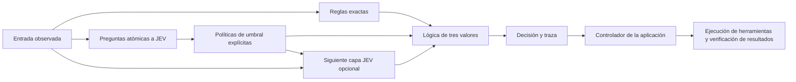

# jev-gates

[English](README.md) · [繁體中文](README.zh-TW.md) · [简体中文](README.zh-CN.md) · [日本語](README.ja.md) · [한국어](README.ko.md) · **Español** · [Français](README.fr.md) · [Deutsch](README.de.md) · [Português (Brasil)](README.pt-BR.md)

**Construye decisiones complejas combinando juicios semánticos acotados.**

JEV responde preguntas concretas; `jev-gates` convierte esas respuestas en señales explícitas `TRUE`, `FALSE` o `UNKNOWN` y las conecta mediante lógica convencional. Define un circuito en JSON, reutilízalo dentro de otro más grande o utiliza las señales anteriores como entrada para una segunda capa semántica.

[Referencia de circuitos](docs/circuits.md) · [Arquitectura](docs/architecture.md) · [Guía de evaluación](docs/evaluation.md). La documentación técnica detallada enlazada está disponible actualmente en inglés.

Versión 0.1.0. TypeScript, Node.js 22+, sin dependencias de ejecución, MIT. Este es un proyecto independiente y no oficial; TypeSafe AI no lo mantiene ni lo respalda. El código fuente está listo para ejecutarse localmente; estas instrucciones no presuponen que se haya publicado en npm.



## Ejecutar la demo sin conexión

Clona el repositorio o utiliza una copia local existente:

```sh
git clone https://github.com/carlchou0dailyfresh/jev-gates.git
cd jev-gates
npm install
npm test
npm run demo
```

La demo utiliza **respuestas simuladas escritas a mano**, no realiza solicitudes de inferencia y devuelve `priority_queue: TRUE`. Demuestra la siguiente expresión:

```text
enterprise AND (urgent OR billing) AND NOT abuse
```

`enterprise` es una comparación exacta de un campo. `urgent`, `billing` y `abuse` son preguntas semánticas. La recomendación no envía mensajes ni modifica una cola de soporte.

```sh
node dist/cli.js validate examples/support-triage.json
node dist/cli.js graph examples/support-triage.json
node dist/cli.js run examples/layered-review.json \
  --input examples/layered-input.json \
  --mock examples/layered-answers.json \
  --trace /tmp/jev-layered-trace.json
```

El ejemplo por capas combina una puntuación, una selección de tema y una comprobación exacta de elegibilidad. Si la compuerta del candidato devuelve verdadero, un segundo nodo semántico lee el mensaje original junto con las dos señales anteriores. Esto demuestra una composición real de capas semánticas, no solo una expresión booleana más grande.

## Conectar un proveedor

Debes elegir explícitamente `--mock` o un proveedor de red. La CLI nunca cambia de forma silenciosa de la inferencia local a un servicio alojado.

```sh
# Requiere un servidor LocalJev en ejecución por separado.
node dist/cli.js run examples/support-triage.json \
  --input examples/support-input.json \
  --provider localjev --base-url http://127.0.0.1:8080

# Configura TYPESAFE_API_KEY en tu entorno antes de ejecutar el comando.
node dist/cli.js run examples/support-triage.json \
  --input examples/support-input.json \
  --provider typesafe --model jev-1.13.0
```

El adaptador de TypeSafe utiliza la [API tipada de JEV](https://docs.typesafe.ai/api). JEV acepta texto y datos textuales estructurados; no examina capturas de pantalla ni controla el ratón. Primero extrae las observaciones con tus propias herramientas. Consulta la [documentación del modelo](https://docs.typesafe.ai/models).

[LocalJev](https://github.com/githubnext/localjev) conecta el protocolo con otro modelo. Ese modelo genera sus probabilidades; debes calibrarlo y evaluar su rendimiento por separado del JEV alojado. Cambiar el backend puede alterar tanto las decisiones como los costes.

## Utilizar la biblioteca

Después de ejecutar `npm run build`, ejecuta este JavaScript desde la raíz del repositorio:

```js
import { readFile } from 'node:fs/promises';
import { MockProvider, runCircuit } from './dist/index.js';

const readJson = async (path) => JSON.parse(await readFile(path, 'utf8'));
const circuit = await readJson('examples/support-triage.json');
const input = await readJson('examples/support-input.json');
const answers = await readJson('examples/support-answers.json');

const result = await runCircuit(circuit, input, {
  provider: new MockProvider(answers),
  maxCalls: 16,
  timeoutMs: 30_000,
});

console.log(result.outputs.priority_queue.truth);
```

Sustituye el proveedor por `new TypeSafeProvider({ apiKey, model })` o `new LocalJevProvider({ baseUrl })` para solicitar inferencias reales de forma explícita. Implementa la interfaz exportada `Provider` para conectar otro backend compatible. `validateCircuit()` comprueba la estructura del circuito, `toMermaid()` genera el diagrama y `mountCircuit(prefix, circuit)` asigna un espacio de nombres a los nodos y las salidas de un subcircuito reutilizable.

## Compuertas e incertidumbre

| Compuerta | Finalidad |
| --- | --- |
| `semantic` | Convertir una respuesta `noul`, `choice` o `score` mediante una política explícita |
| `rule` | Comparar campos de entrada reales sin utilizar un modelo |
| `logic` | `and`, `or`, `not`, `nand`, `nor`, `xor` o `kofn` |
| `constant` | Proporcionar una señal fija de tres valores |

Los umbrales incluyen una zona de abstención. Por ejemplo, una política Noul con `falseAt: 0.2` y `trueAt: 0.8` produce `UNKNOWN` entre esos valores. Son umbrales ilustrativos, no garantías de calidad medidas. Las políticas de tipo Choice distribuyen explícitamente todas las etiquetas en conjuntos de verdadero, falso y desconocido.

`UNKNOWN` no es falso. `NOT UNKNOWN` sigue siendo desconocido; `FALSE AND UNKNOWN` es falso; `TRUE OR UNKNOWN` es verdadero. Las entradas ausentes, las respuestas mal formadas, los tiempos de espera agotados y los presupuestos de llamadas agotados se convierten en señales desconocidas. Un nodo semántico condicional solo se ejecuta cuando su señal `when` es verdadera; de lo contrario, se omite y devuelve una señal desconocida con el motivo. Un contexto desconocido también provoca abstención.

El motor no multiplica probabilidades para inventar una confianza global del circuito. Encadenar preguntas relacionadas puede repetir el mismo error; los circuitos más profundos no garantizan mayor precisión. Lee la [guía de evaluación](docs/evaluation.md) antes de elegir umbrales para datos reales.

## Integrar con un controlador

Mantén separadas la planificación, el juicio, la acción y la verificación. El circuito emite una decisión orientativa y una traza. El código de la aplicación decide qué acciones están permitidas, ejecuta las herramientas y verifica los resultados reales antes de declarar el éxito. Consulta la [arquitectura](docs/architecture.md) y el [ejemplo de controlador](examples/controller.mjs).

```sh
node examples/controller.mjs
```

Esta simulación local escribe un CSV, verifica su contenido y guarda un punto de control. No exporta un informe empresarial real.

No se necesitan credenciales para las pruebas o los ejemplos que utilizan respuestas simuladas. Las llamadas de red envían las observaciones y el contexto seleccionados al proveedor configurado. Revisa las trazas antes de compartirlas; los hashes no constituyen anonimización. Consulta las [indicaciones de seguridad](SECURITY.md).

## Contribuir

Consulta [CONTRIBUTING.md](CONTRIBUTING.md). La CI ejecuta pruebas y comprobaciones del paquete en Node.js 22 y 24 sin inferencias reales. La calidad de los modelos en uso real, la disponibilidad del servidor local y el comportamiento de las herramientas externas deben validarse por separado.

Publicado bajo la licencia [MIT](LICENSE).
