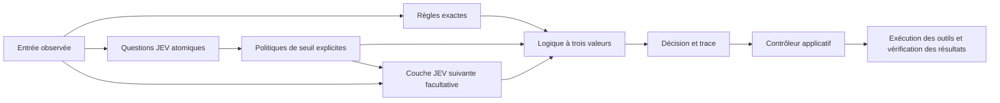

# jev-gates

[English](README.md) · [繁體中文](README.zh-TW.md) · [简体中文](README.zh-CN.md) · [日本語](README.ja.md) · [한국어](README.ko.md) · [Español](README.es.md) · **Français** · [Deutsch](README.de.md) · [Português (Brasil)](README.pt-BR.md)

**Composez de petits jugements sémantiques pour construire des décisions complexes.**

JEV répond à des questions ciblées ; `jev-gates` transforme ces réponses en signaux explicites `TRUE`, `FALSE` ou `UNKNOWN`, puis les combine avec des opérations logiques classiques. Définissez un circuit en JSON, réutilisez-le dans un circuit plus vaste ou transmettez ses signaux à une deuxième couche sémantique.

[Référence des circuits](docs/circuits.md) · [Architecture](docs/architecture.md) · [Guide d’évaluation](docs/evaluation.md)

Les documents techniques détaillés accessibles par ces liens sont actuellement en anglais.

Version 0.1.0. TypeScript, Node.js 22+, aucune dépendance à l’exécution, MIT. Ce projet indépendant et non officiel n’est ni maintenu ni approuvé par TypeSafe AI. Le code source peut être exécuté localement ; ces instructions ne supposent pas une publication sur npm.



## Exécuter la démo hors ligne

Clonez le dépôt ou utilisez votre copie de travail existante :

```sh
git clone https://github.com/carlchou0dailyfresh/jev-gates.git
cd jev-gates
npm install
npm test
npm run demo
```

La démo utilise des **réponses simulées écrites à la main**, n’envoie aucune requête d’inférence et renvoie `priority_queue: TRUE`. Elle illustre l’expression suivante :

```text
enterprise AND (urgent OR billing) AND NOT abuse
```

`enterprise` est une comparaison exacte de champ. `urgent`, `billing` et `abuse` sont des questions sémantiques. La recommandation n’envoie aucun message et ne modifie aucune file de traitement du support.

```sh
node dist/cli.js validate examples/support-triage.json
node dist/cli.js graph examples/support-triage.json
node dist/cli.js run examples/layered-review.json \
  --input examples/layered-input.json \
  --mock examples/layered-answers.json \
  --trace /tmp/jev-layered-trace.json
```

L’exemple à plusieurs couches combine un score, un choix de sujet et un critère d’éligibilité exact. Si la porte de présélection est vraie, un deuxième nœud sémantique lit le message d’origine ainsi que les deux signaux précédents. Cet exemple montre une véritable composition de couches sémantiques, au-delà d’une simple expression booléenne plus longue.

## Connecter un fournisseur

Vous devez choisir explicitement `--mock` ou un fournisseur réseau. La CLI ne passe jamais silencieusement d’une inférence locale à un service hébergé.

```sh
# Nécessite un serveur LocalJev déjà démarré séparément.
node dist/cli.js run examples/support-triage.json \
  --input examples/support-input.json \
  --provider localjev --base-url http://127.0.0.1:8080

# Définissez TYPESAFE_API_KEY dans votre environnement avant l’exécution.
node dist/cli.js run examples/support-triage.json \
  --input examples/support-input.json \
  --provider typesafe --model jev-1.13.0
```

L’adaptateur TypeSafe utilise l’[API JEV typée](https://docs.typesafe.ai/api). JEV accepte du texte et des données textuelles structurées ; il n’analyse pas les captures d’écran et ne manipule pas la souris. Extrayez d’abord les observations avec vos propres outils. Consultez la [documentation du modèle](https://docs.typesafe.ai/models).

[LocalJev](https://github.com/githubnext/localjev) adapte le protocole à un autre modèle. Les probabilités sont générées par ce modèle ; calibrez-le et mesurez ses performances séparément de JEV hébergé. Un changement de backend peut modifier les décisions comme les coûts.

## Utiliser la bibliothèque

Après `npm run build`, exécutez ce JavaScript depuis la racine du dépôt :

```js
import { readFile } from 'node:fs/promises';
import { MockProvider, runCircuit } from './dist/index.js';

const readJson = async (path) => JSON.parse(await readFile(path, 'utf8'));
const circuit = await readJson('examples/support-triage.json');
const input = await readJson('examples/support-input.json');
const answers = await readJson('examples/support-answers.json');

const result = await runCircuit(circuit, input, {
  provider: new MockProvider(answers),
  maxCalls: 16,
  timeoutMs: 30_000,
});

console.log(result.outputs.priority_queue.truth);
```

Remplacez le fournisseur par `new TypeSafeProvider({ apiKey, model })` ou `new LocalJevProvider({ baseUrl })` pour activer explicitement l’inférence réelle. Implémentez l’interface exportée `Provider` pour connecter un autre backend compatible. `validateCircuit()` vérifie la structure du circuit, `toMermaid()` génère son graphe, et `mountCircuit(prefix, circuit)` attribue un espace de noms aux nœuds et aux sorties d’un sous-circuit réutilisable.

## Portes et incertitude

| Porte | Rôle |
| --- | --- |
| `semantic` | Convertir une réponse `noul`, `choice` ou `score` selon une politique explicite |
| `rule` | Comparer les champs réels de l’entrée sans modèle |
| `logic` | `and`, `or`, `not`, `nand`, `nor`, `xor` ou `kofn` |
| `constant` | Fournir un signal fixe parmi les trois valeurs possibles |

Les seuils délimitent une zone d’abstention. Par exemple, une politique Noul avec `falseAt: 0.2` et `trueAt: 0.8` produit `UNKNOWN` entre ces deux valeurs. Ces seuils sont donnés à titre d’illustration et ne constituent pas des garanties de qualité mesurées. Les politiques de choix répartissent explicitement toutes les étiquettes entre les ensembles vrai, faux et inconnu.

`UNKNOWN` n’est pas faux. `NOT UNKNOWN` reste inconnu ; `FALSE AND UNKNOWN` est faux ; `TRUE OR UNKNOWN` est vrai. Les entrées manquantes, les réponses mal formées, les délais dépassés et les budgets d’appels épuisés produisent des signaux inconnus. Un nœud sémantique conditionnel ne s’exécute que si son signal `when` est vrai ; sinon, il est ignoré et produit un signal inconnu accompagné d’un motif. Un contexte inconnu entraîne également une abstention.

Le moteur ne multiplie pas les probabilités pour inventer un indice de confiance global du circuit. Empiler des questions liées peut reproduire la même erreur ; un circuit plus profond ne garantit pas une meilleure précision. Lisez le [guide d’évaluation](docs/evaluation.md) avant de choisir les seuils à appliquer à des données réelles.

## Intégrer un contrôleur

Séparez la planification, le jugement, l’action et la vérification. Le circuit émet une décision consultative et une trace. Le code applicatif décide des actions autorisées, exécute les outils et vérifie les résultats réels avant de déclarer la réussite. Consultez l’[architecture](docs/architecture.md) et l’[exemple de contrôleur](examples/controller.mjs).

```sh
node examples/controller.mjs
```

Cette simulation locale écrit un fichier CSV, vérifie son contenu et enregistre un point de reprise. Elle n’exporte pas de rapport métier réel.

Les tests et les exemples utilisant des réponses simulées ne nécessitent aucun identifiant d’accès. Les appels réseau transmettent les observations et le contexte sélectionnés au fournisseur configuré. Examinez les traces avant de les partager ; les empreintes de hachage ne constituent pas une anonymisation. Consultez les [consignes de sécurité](SECURITY.md).

## Contribuer

Consultez [CONTRIBUTING.md](CONTRIBUTING.md). La CI exécute les tests et les vérifications du paquet sous Node.js 22 et 24, sans inférence réelle. La qualité des modèles réels, la disponibilité du serveur local et le comportement des outils externes doivent être validés séparément.

Sous licence [MIT](LICENSE).
