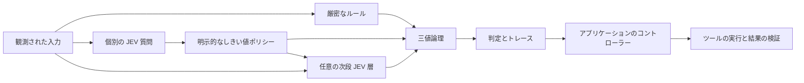

# jev-gates

[English](README.md) · [繁體中文](README.zh-TW.md) · [简体中文](README.zh-CN.md) · **日本語** · [한국어](README.ko.md) · [Español](README.es.md) · [Français](README.fr.md) · [Deutsch](README.de.md) · [Português (Brasil)](README.pt-BR.md)

**小さな意味判定を組み合わせて、複雑な意思決定を構築。**

JEV は焦点を絞った質問に答えます。`jev-gates` はその回答を明示的な `TRUE`、`FALSE`、`UNKNOWN` の信号に変換し、通常の論理演算でつなぎます。JSON で回路を定義し、より大きな回路の中で再利用したり、前段の信号を次の意味判定層に渡したりできます。

[回路リファレンス](docs/circuits.md) · [アーキテクチャ](docs/architecture.md) · [評価ガイド](docs/evaluation.md) — リンク先の詳細な技術文書は現在英語です。

バージョン 0.1.0。TypeScript、Node.js 22+、実行時依存なし、MIT ライセンス。本プロジェクトは独立した非公式プロジェクトであり、TypeSafe AI による保守や公認は受けていません。ソースはローカルで実行できます。この手順は npm への公開を前提としていません。



## オフラインデモを実行する

リポジトリをクローンするか、既存のチェックアウトを使用します。

```sh
git clone https://github.com/carlchou0dailyfresh/jev-gates.git
cd jev-gates
npm install
npm test
npm run demo
```

このデモは**手書きのモック回答**を使用し、推論リクエストを送信せずに `priority_queue: TRUE` を返します。次の判定を実演します。

```text
enterprise AND (urgent OR billing) AND NOT abuse
```

`enterprise` はフィールドの厳密な比較です。`urgent`、`billing`、`abuse` は意味を判定する質問です。この推奨判定自体は、メッセージの送信やサポートキューの変更を行いません。

```sh
node dist/cli.js validate examples/support-triage.json
node dist/cli.js graph examples/support-triage.json
node dist/cli.js run examples/layered-review.json \
  --input examples/layered-input.json \
  --mock examples/layered-answers.json \
  --trace /tmp/jev-layered-trace.json
```

多層の例では、スコア、トピックの選択、厳密な適格性判定を組み合わせます。候補ゲートを通過すると、第 2 の意味判定ノードが元のメッセージと前段の 2 つの信号を読み取ります。単にブール式を大きくするのではなく、意味判定そのものを多層化する例です。

## プロバイダーを接続する

`--mock` またはネットワーク経由のプロバイダーを明示的に選ぶ必要があります。CLI がローカル推論からホスト型サービスへ暗黙に切り替わることはありません。

```sh
# 別途起動済みの LocalJev サーバーが必要です。
node dist/cli.js run examples/support-triage.json \
  --input examples/support-input.json \
  --provider localjev --base-url http://127.0.0.1:8080

# 実行前に環境変数 TYPESAFE_API_KEY を設定してください。
node dist/cli.js run examples/support-triage.json \
  --input examples/support-input.json \
  --provider typesafe --model jev-1.13.0
```

TypeSafe アダプターは[型付き JEV API](https://docs.typesafe.ai/api) を使用します。JEV はテキストと構造化テキストデータを受け取りますが、スクリーンショットの解析やマウス操作は行いません。まず利用するツールで観測情報を取得してください。[モデルのドキュメント](https://docs.typesafe.ai/models)を参照してください。

[LocalJev](https://github.com/githubnext/localjev) は、このプロトコルを別のモデルに接続します。確率値はそのモデルが生成するため、ホスト型 JEV とは別に校正とベンチマークを行ってください。バックエンドを変更すると、判定とコストの両方が変わる可能性があります。

## ライブラリを使用する

`npm run build` の後、リポジトリのルートから次の JavaScript を実行します。

```js
import { readFile } from 'node:fs/promises';
import { MockProvider, runCircuit } from './dist/index.js';

const readJson = async (path) => JSON.parse(await readFile(path, 'utf8'));
const circuit = await readJson('examples/support-triage.json');
const input = await readJson('examples/support-input.json');
const answers = await readJson('examples/support-answers.json');

const result = await runCircuit(circuit, input, {
  provider: new MockProvider(answers),
  maxCalls: 16,
  timeoutMs: 30_000,
});

console.log(result.outputs.priority_queue.truth);
```

実際の推論を明示的に利用するには、`new TypeSafeProvider({ apiKey, model })` または `new LocalJevProvider({ baseUrl })` に置き換えます。別の互換バックエンドを接続するには、エクスポートされている `Provider` インターフェースを実装します。`validateCircuit()` は回路構造を検証し、`toMermaid()` はグラフを生成します。`mountCircuit(prefix, circuit)` は再利用可能なサブ回路のノードと出力に名前空間を付けます。

## ゲートと不確実性

| ゲート | 用途 |
| --- | --- |
| `semantic` | 明示的なポリシーに従って `noul`、`choice`、`score` の回答を変換する |
| `rule` | モデルを使わずに実際の入力フィールドを比較する |
| `logic` | `and`、`or`、`not`、`nand`、`nor`、`xor`、`kofn` |
| `constant` | 固定の三値信号を供給する |

しきい値には、判定を保留する領域を設けます。たとえば、`falseAt: 0.2`、`trueAt: 0.8` の Noul ポリシーでは、この 2 つの値の間で `UNKNOWN` になります。これらは説明用のしきい値であり、実測に基づく品質保証ではありません。Choice ポリシーでは、すべてのラベルを真・偽・不明の集合に明示的に振り分けます。

`UNKNOWN` は偽ではありません。`NOT UNKNOWN` は不明のまま、`FALSE AND UNKNOWN` は偽、`TRUE OR UNKNOWN` は真になります。入力の欠落、不正な形式の応答、タイムアウト、呼び出し回数の上限到達は、不明の信号になります。条件付きの意味判定ノードは、その `when` 信号が真の場合にのみ実行されます。それ以外はスキップされ、不明の信号と理由を返します。コンテキストが不明の場合も判定を保留します。

エンジンは確率を掛け合わせて、根拠のない回路全体の信頼度を作り出しません。関連する質問を積み重ねると、同じ誤りを繰り返す可能性があります。回路を深くしても、精度の向上は保証されません。実データ向けのしきい値を選ぶ前に、[評価ガイド](docs/evaluation.md)を読んでください。

## コントローラーと統合する

計画、判定、操作、検証を分離してください。回路は助言としての判定とトレースを出力します。アプリケーションコードが許可される操作を決め、ツールを実行し、実際の結果を検証してから成功と判定します。[アーキテクチャ](docs/architecture.md)と[コントローラーの例](examples/controller.mjs)を参照してください。

```sh
node examples/controller.mjs
```

このローカルシミュレーションは CSV を書き出し、その内容を検証して、チェックポイントを保存します。実際の業務レポートをエクスポートするものではありません。

モックを使うテストや例には、認証情報は必要ありません。ネットワーク呼び出しでは、選択した観測情報とコンテキストが設定済みのプロバイダーに送信されます。トレースは共有前に内容を確認してください。ハッシュ化は匿名化ではありません。[セキュリティガイド](SECURITY.md)を参照してください。

## コントリビューション

[CONTRIBUTING.md](CONTRIBUTING.md) を参照してください。CI は Node.js 22 と 24 で、実際の推論を行わずにテストとパッケージチェックを実行します。実際のモデル品質、ローカルサーバーの可用性、外部ツールの動作は、別途検証する必要があります。

[MIT](LICENSE) ライセンスで公開しています。
