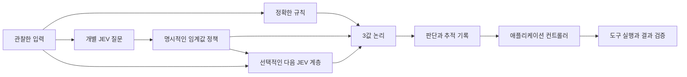

# jev-gates

[English](README.md) · [繁體中文](README.zh-TW.md) · [简体中文](README.zh-CN.md) · [日本語](README.ja.md) · **한국어** · [Español](README.es.md) · [Français](README.fr.md) · [Deutsch](README.de.md) · [Português (Brasil)](README.pt-BR.md)

**작은 의미 판단을 조합해 복잡한 의사결정을 만드세요.**

JEV는 범위가 명확한 질문에 답합니다. `jev-gates`는 그 답을 명시적인 `TRUE`, `FALSE`, `UNKNOWN` 신호로 변환하고 일반적인 논리 연산으로 연결합니다. JSON으로 회로를 정의하고 더 큰 회로 안에서 재사용하거나, 앞선 신호를 다음 의미 판단 계층에 전달할 수 있습니다.

[회로 레퍼런스](docs/circuits.md) · [아키텍처](docs/architecture.md) · [평가 가이드](docs/evaluation.md) — 연결된 상세 기술 문서는 현재 영어로 제공됩니다.

버전 0.1.0. TypeScript, Node.js 22+, 런타임 의존성 없음, MIT 라이선스. 이 프로젝트는 독립적인 비공식 프로젝트이며 TypeSafe AI가 유지 관리하거나 공인하지 않습니다. 소스를 로컬에서 실행할 수 있으며, 이 안내는 npm에 패키지가 게시되어 있다고 가정하지 않습니다.



## 오프라인 데모 실행

저장소를 복제하거나 기존 체크아웃을 사용하세요.

```sh
git clone https://github.com/carlchou0dailyfresh/jev-gates.git
cd jev-gates
npm install
npm test
npm run demo
```

데모는 **직접 작성한 모의 응답**을 사용하며, 추론 요청 없이 `priority_queue: TRUE`를 반환합니다. 다음 판단을 보여 줍니다.

```text
enterprise AND (urgent OR billing) AND NOT abuse
```

`enterprise`는 필드를 정확하게 비교합니다. `urgent`, `billing`, `abuse`는 의미를 판단하는 질문입니다. 이 권고 판단 자체는 메시지를 보내거나 고객 지원 대기열을 변경하지 않습니다.

```sh
node dist/cli.js validate examples/support-triage.json
node dist/cli.js graph examples/support-triage.json
node dist/cli.js run examples/layered-review.json \
  --input examples/layered-input.json \
  --mock examples/layered-answers.json \
  --trace /tmp/jev-layered-trace.json
```

다층 예제는 점수, 주제 선택, 정확한 적격성 검사를 조합합니다. 후보 게이트를 통과하면 두 번째 의미 판단 노드가 원본 메시지와 앞선 두 신호를 읽습니다. 단순히 불리언 표현식을 키우는 것이 아니라, 의미 판단 자체를 여러 계층으로 쌓는 예제입니다.

## 제공자 연결

`--mock` 또는 네트워크 제공자를 명시적으로 선택해야 합니다. CLI는 로컬 추론에서 호스팅 서비스로 자동 전환하지 않습니다.

```sh
# 별도로 실행 중인 LocalJev 서버가 필요합니다.
node dist/cli.js run examples/support-triage.json \
  --input examples/support-input.json \
  --provider localjev --base-url http://127.0.0.1:8080

# 실행 전에 환경 변수 TYPESAFE_API_KEY를 설정하세요.
node dist/cli.js run examples/support-triage.json \
  --input examples/support-input.json \
  --provider typesafe --model jev-1.13.0
```

TypeSafe 어댑터는 [타입이 정의된 JEV API](https://docs.typesafe.ai/api)를 사용합니다. JEV는 텍스트와 구조화된 텍스트 데이터를 입력받으며, 스크린샷을 분석하거나 마우스를 조작하지 않습니다. 먼저 사용하는 도구로 관찰 정보를 추출하세요. [모델 문서](https://docs.typesafe.ai/models)를 참고하세요.

[LocalJev](https://github.com/githubnext/localjev)는 이 프로토콜을 다른 모델에 연결합니다. 확률값은 해당 모델이 생성하므로, 호스팅 JEV와 별도로 보정하고 벤치마크해야 합니다. 백엔드를 바꾸면 판단과 비용이 모두 달라질 수 있습니다.

## 라이브러리 사용

`npm run build`를 실행한 다음, 저장소 루트에서 아래 JavaScript를 실행하세요.

```js
import { readFile } from 'node:fs/promises';
import { MockProvider, runCircuit } from './dist/index.js';

const readJson = async (path) => JSON.parse(await readFile(path, 'utf8'));
const circuit = await readJson('examples/support-triage.json');
const input = await readJson('examples/support-input.json');
const answers = await readJson('examples/support-answers.json');

const result = await runCircuit(circuit, input, {
  provider: new MockProvider(answers),
  maxCalls: 16,
  timeoutMs: 30_000,
});

console.log(result.outputs.priority_queue.truth);
```

실제 추론을 명시적으로 사용하려면 `new TypeSafeProvider({ apiKey, model })` 또는 `new LocalJevProvider({ baseUrl })`로 교체하세요. 다른 호환 백엔드를 연결하려면 내보낸 `Provider` 인터페이스를 구현하세요. `validateCircuit()`은 회로 구조를 검사하고, `toMermaid()`는 그래프를 생성합니다. `mountCircuit(prefix, circuit)`은 재사용 가능한 하위 회로의 노드와 출력에 네임스페이스를 부여합니다.

## 게이트와 불확실성

| 게이트 | 용도 |
| --- | --- |
| `semantic` | 명시적인 정책에 따라 `noul`, `choice`, `score` 응답을 변환 |
| `rule` | 모델 없이 실제 입력 필드를 비교 |
| `logic` | `and`, `or`, `not`, `nand`, `nor`, `xor`, `kofn` |
| `constant` | 고정된 3값 신호를 제공 |

임계값에는 판단을 보류하는 구간이 포함됩니다. 예를 들어 `falseAt: 0.2`, `trueAt: 0.8`인 Noul 정책에서는 두 값 사이의 결과가 `UNKNOWN`이 됩니다. 이 값들은 설명을 위한 임계값이며, 측정에 근거한 품질 보장이 아닙니다. Choice 정책은 모든 레이블을 참, 거짓, 알 수 없음 집합으로 명시적으로 나눕니다.

`UNKNOWN`은 거짓이 아닙니다. `NOT UNKNOWN`은 알 수 없는 상태로 유지되고, `FALSE AND UNKNOWN`은 거짓이며, `TRUE OR UNKNOWN`은 참입니다. 입력 누락, 잘못된 형식의 응답, 시간 초과, 호출 횟수 한도 소진은 알 수 없음 신호가 됩니다. 조건부 의미 판단 노드는 해당 `when` 신호가 참일 때만 실행됩니다. 그 외에는 실행을 건너뛰고 알 수 없음 신호와 사유를 반환합니다. 컨텍스트를 알 수 없는 경우에도 판단을 보류합니다.

엔진은 확률들을 곱해 근거 없는 회로 전체의 신뢰도를 만들어 내지 않습니다. 관련된 질문을 쌓으면 같은 실수가 반복될 수 있습니다. 회로가 깊어진다고 정확도가 높아지는 것은 아닙니다. 실제 데이터에 적용할 임계값을 선택하기 전에 [평가 가이드](docs/evaluation.md)를 읽어 보세요.

## 컨트롤러와 통합

계획, 판단, 행동, 검증을 분리하세요. 회로는 권고 판단과 추적 기록을 출력합니다. 애플리케이션 코드는 허용할 행동을 결정하고 도구를 실행하며, 성공을 선언하기 전에 실제 결과를 검증합니다. [아키텍처](docs/architecture.md)와 [컨트롤러 예제](examples/controller.mjs)를 참고하세요.

```sh
node examples/controller.mjs
```

이 로컬 시뮬레이션은 CSV를 작성하고 내용을 검증한 다음 체크포인트를 저장합니다. 실제 업무 보고서를 내보내지는 않습니다.

모의 응답을 사용하는 테스트와 예제에는 인증 정보가 필요하지 않습니다. 네트워크 호출은 선택한 관찰 정보와 컨텍스트를 설정된 제공자에게 전송합니다. 추적 기록을 공유하기 전에 내용을 확인하세요. 해싱은 익명화가 아닙니다. [보안 가이드](SECURITY.md)를 참고하세요.

## 기여

[CONTRIBUTING.md](CONTRIBUTING.md)를 참고하세요. CI는 실제 추론 없이 Node.js 22와 24에서 테스트와 패키지 검사를 실행합니다. 실제 모델 품질, 로컬 서버 가용성, 외부 도구 동작은 별도로 검증해야 합니다.

[MIT](LICENSE) 라이선스로 배포됩니다.
