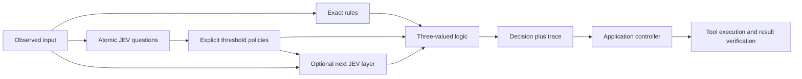

# jev-gates

**Bus arrivals:** `/delivery/bus` offers Taipei Main Station, City Hall and Palace Museum examples. Official public ETA snapshots pass deterministic freshness, station and direction gates before display; expired numbers disappear even with auto-refresh paused. Snapshot freshness is not vehicle GPS freshness or arrival accuracy. [Bus guide](docs/bus-arrivals.md).

**JEV Maps:** choose an origin and destination at `/delivery` in Studio. A full-screen map combines OSRM road alternatives, manual Photon place search and automatically fetched public police traffic reports; only reports updated within 15 minutes remain eligible, with uncertain locations marked unverified. Nearby official Taipei road-speed observations require a source snapshot within 120 seconds; they are 5-minute smoothed averages and do not modify the OSRM ETA. [Route guide](docs/simple-routes.md). The editable six-stop, four-policy research experiment remains at `/delivery/lab`. OSRM is not live traffic and demo results do not prove savings. [Experiment guide](docs/delivery-experiment.md).

**New: JEV Studio** — a local interactive workbench with four synthetic scenarios, editable semantic gates and branches, LocalJev inference, and an Ollama language bridge. Run `npm ci`, `npm ci --prefix workbench`, then `npm run studio:dev` (Node 22.12+), and open `http://127.0.0.1:3088`. [Studio guide (繁體中文)](docs/studio.md). Fixture results do not establish real JEV accuracy or AGI capabilities.

**English** · [繁體中文](README.zh-TW.md) · [简体中文](README.zh-CN.md) · [日本語](README.ja.md) · [한국어](README.ko.md) · [Español](README.es.md) · [Français](README.fr.md) · [Deutsch](README.de.md) · [Português (Brasil)](README.pt-BR.md)

**Build complex decisions by composing small semantic judgments.**

JEV answers focused questions; `jev-gates` turns those answers into explicit `TRUE`, `FALSE`, or `UNKNOWN` signals and connects them with ordinary logic. Build a circuit as JSON, reuse it inside a larger circuit, or feed earlier signals into a second semantic layer.

[Circuit reference](docs/circuits.md) · [Architecture](docs/architecture.md) · [Evaluation guide](docs/evaluation.md)

Version 0.1.0. TypeScript, Node.js 22+, zero runtime dependencies, MIT. This is an independent, unofficial project; it is not maintained or endorsed by TypeSafe AI. The source is ready to run locally; these instructions do not assume an npm publication.



## 本機語意研究工作台

需要 Node.js 22.12+（或 24+）。在 repository 根目錄執行：

```sh
npm ci
npm run workbench
```

開啟 `http://127.0.0.1:4317`。四個繁體中文情境不需金鑰即可用 fixture 操作；UI 依賴在 `ui/`，核心函式庫沒有 React 執行期依賴。

```sh
npm run research:demo
node dist/cli.js verify-report .jev-runs/<runId>.json
node dist/cli.js replay .jev-runs/<runId>.json
npm run research:eval
npm run research:smoke  # 一次既有本機 LocalJev 推論，不自動改用雲端
```

安裝已打包套件後，也可用 `jev-gates workbench` 啟動隨附介面。完整操作、資料保存、預算與研究界線見 [工作台操作手冊](docs/workbench.md)、[情境導覽](docs/scenarios.md)、[評測協議](docs/eval-protocol.md)。fixture、工作流程完成與真實模型品質分開呈現；本工作台沒有已驗證 AGI 的主張。

## Run the offline demo

Clone the repository, or use your existing checkout:

```sh
git clone https://github.com/carlchou0dailyfresh/jev-gates.git
cd jev-gates
npm install
npm test
npm run demo
```

The demo uses **hand-written mock answers**, makes no inference requests, and returns `priority_queue: TRUE`. It demonstrates:

```text
enterprise AND (urgent OR billing) AND NOT abuse
```

`enterprise` is an exact field comparison. `urgent`, `billing`, and `abuse` are semantic questions. The recommendation does not send a message or change a support queue.

```sh
node dist/cli.js validate examples/support-triage.json
node dist/cli.js graph examples/support-triage.json
node dist/cli.js run examples/layered-review.json \
  --input examples/layered-input.json \
  --mock examples/layered-answers.json \
  --trace /tmp/jev-layered-trace.json
```

The layered example combines a score, a topic choice, and exact eligibility. If the candidate gate passes, a second semantic node reads the original message plus the two prior signals. This demonstrates actual semantic layering, not just a larger Boolean expression.

## Connect a provider

You must explicitly choose `--mock` or a network provider. The CLI never silently switches from local inference to a hosted service.

```sh
# Requires an independently running LocalJev server.
node dist/cli.js run examples/support-triage.json \
  --input examples/support-input.json \
  --provider localjev --base-url http://127.0.0.1:8080

# Set TYPESAFE_API_KEY in your environment before running.
node dist/cli.js run examples/support-triage.json \
  --input examples/support-input.json \
  --provider typesafe --model jev-1.13.0
```

The TypeSafe adapter uses the [typed JEV API](https://docs.typesafe.ai/api). JEV accepts text and structured text data; it does not inspect screenshots or operate a mouse. Extract observations with your own tools first. See the [model documentation](https://docs.typesafe.ai/models).

[LocalJev](https://github.com/githubnext/localjev) bridges the protocol to another model. Its probabilities are generated by that model; calibrate and benchmark it separately from hosted JEV. Changing the backend can change both decisions and costs.

## Use the library

After `npm run build`, run this JavaScript from the repository root:

```js
import { readFile } from 'node:fs/promises';
import { MockProvider, runCircuit } from './dist/index.js';

const readJson = async (path) => JSON.parse(await readFile(path, 'utf8'));
const circuit = await readJson('examples/support-triage.json');
const input = await readJson('examples/support-input.json');
const answers = await readJson('examples/support-answers.json');

const result = await runCircuit(circuit, input, {
  provider: new MockProvider(answers),
  maxCalls: 16,
  timeoutMs: 30_000,
});

console.log(result.outputs.priority_queue.truth);
```

Swap in `new TypeSafeProvider({ apiKey, model })` or `new LocalJevProvider({ baseUrl })` for explicit live inference. Implement the exported `Provider` interface to connect another compatible backend. `validateCircuit()` checks circuit structure, `toMermaid()` renders the graph, and `mountCircuit(prefix, circuit)` namespaces a reusable subcircuit's nodes and outputs.

## Gates and uncertainty

| Gate | Purpose |
| --- | --- |
| `semantic` | Convert a `noul`, `choice`, or `score` answer using an explicit policy |
| `rule` | Compare actual input fields without a model |
| `logic` | `and`, `or`, `not`, `nand`, `nor`, `xor`, or `kofn` |
| `constant` | Supply a fixed three-valued signal |

Thresholds include an abstention region. For example, a Noul policy with `falseAt: 0.2` and `trueAt: 0.8` yields `UNKNOWN` between those values. These are illustrative thresholds, not measured quality guarantees. Choice policies explicitly partition all labels into true, false, and unknown sets.

`UNKNOWN` is not false. `NOT UNKNOWN` stays unknown; `FALSE AND UNKNOWN` is false; `TRUE OR UNKNOWN` is true. Missing input, malformed responses, timeouts, and exhausted call budgets become unknown signals. A conditional semantic node runs only when its `when` signal is true; otherwise it is skipped with an unknown signal and a reason. Unknown context also causes abstention.

The engine does not multiply probabilities into an invented circuit confidence. Stacking related questions can repeat the same mistake; deeper circuits do not guarantee greater accuracy. Read [evaluation guidance](docs/evaluation.md) before choosing thresholds for real data.

## Integrate with a controller

Keep planning, judgment, action, and verification separate. The circuit emits an advisory decision and a trace. Application code decides which actions are permitted, executes tools, and verifies actual results before declaring success. See [the architecture](docs/architecture.md) and [the controller example](examples/controller.mjs).

```sh
node examples/controller.mjs
```

This local simulation writes a CSV, verifies its contents, and saves a checkpoint. It does not export a live business report.

No credentials are needed for tests or examples that use mocks. Network calls send selected observations and context to the configured provider. Inspect traces before sharing them; hashes are not anonymization. See [security guidance](SECURITY.md).

## Contribute

See [CONTRIBUTING.md](CONTRIBUTING.md). CI runs tests and package checks on Node.js 22 and 24 without live inference. Live model quality, local-server availability, and external tool behavior must be validated separately.

Licensed under [MIT](LICENSE).
