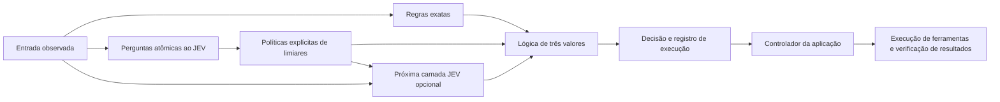

# jev-gates

[English](README.md) · [繁體中文](README.zh-TW.md) · [简体中文](README.zh-CN.md) · [日本語](README.ja.md) · [한국어](README.ko.md) · [Español](README.es.md) · [Français](README.fr.md) · [Deutsch](README.de.md) · **Português (Brasil)**

**Construa decisões complexas combinando pequenos julgamentos semânticos.**

O JEV responde a perguntas específicas; o `jev-gates` transforma essas respostas em sinais explícitos `TRUE`, `FALSE` ou `UNKNOWN` e os conecta usando lógica convencional. Defina um circuito em JSON, reutilize-o dentro de um circuito maior ou use os sinais anteriores como entrada para uma segunda camada semântica.

[Referência de circuitos](docs/circuits.md) · [Arquitetura](docs/architecture.md) · [Guia de avaliação](docs/evaluation.md). A documentação técnica detalhada nos links está disponível atualmente em inglês.

Versão 0.1.0. TypeScript, Node.js 22+, sem dependências de execução, MIT. Este é um projeto independente e não oficial; ele não é mantido nem endossado pela TypeSafe AI. O código-fonte está pronto para execução local; estas instruções não pressupõem uma publicação no npm.



## Executar a demonstração offline

Clone o repositório ou use uma cópia local existente:

```sh
git clone https://github.com/carlchou0dailyfresh/jev-gates.git
cd jev-gates
npm install
npm test
npm run demo
```

A demonstração usa **respostas simuladas escritas manualmente**, não faz solicitações de inferência e retorna `priority_queue: TRUE`. Ela demonstra a expressão:

```text
enterprise AND (urgent OR billing) AND NOT abuse
```

`enterprise` é uma comparação exata de um campo. `urgent`, `billing` e `abuse` são perguntas semânticas. A recomendação não envia mensagens nem altera uma fila de suporte.

```sh
node dist/cli.js validate examples/support-triage.json
node dist/cli.js graph examples/support-triage.json
node dist/cli.js run examples/layered-review.json \
  --input examples/layered-input.json \
  --mock examples/layered-answers.json \
  --trace /tmp/jev-layered-trace.json
```

O exemplo em camadas combina uma pontuação, uma escolha de tópico e uma verificação exata de elegibilidade. Se a porta lógica do candidato retornar verdadeiro, um segundo nó semântico lê a mensagem original junto com os dois sinais anteriores. Isso demonstra uma composição real de camadas semânticas, não apenas uma expressão booleana maior.

## Conectar um provedor

Você precisa escolher explicitamente `--mock` ou um provedor de rede. A CLI nunca muda silenciosamente da inferência local para um serviço hospedado.

```sh
# Requer um servidor LocalJev em execução separadamente.
node dist/cli.js run examples/support-triage.json \
  --input examples/support-input.json \
  --provider localjev --base-url http://127.0.0.1:8080

# Defina TYPESAFE_API_KEY no seu ambiente antes de executar o comando.
node dist/cli.js run examples/support-triage.json \
  --input examples/support-input.json \
  --provider typesafe --model jev-1.13.0
```

O adaptador TypeSafe usa a [API tipada do JEV](https://docs.typesafe.ai/api). O JEV aceita texto e dados textuais estruturados; ele não examina capturas de tela nem controla o mouse. Primeiro, extraia as observações com suas próprias ferramentas. Consulte a [documentação do modelo](https://docs.typesafe.ai/models).

O [LocalJev](https://github.com/githubnext/localjev) conecta o protocolo a outro modelo. As probabilidades são geradas por esse modelo; calibre e avalie seu desempenho separadamente do JEV hospedado. Mudar o backend pode alterar tanto as decisões quanto os custos.

## Usar a biblioteca

Depois de executar `npm run build`, execute este JavaScript a partir da raiz do repositório:

```js
import { readFile } from 'node:fs/promises';
import { MockProvider, runCircuit } from './dist/index.js';

const readJson = async (path) => JSON.parse(await readFile(path, 'utf8'));
const circuit = await readJson('examples/support-triage.json');
const input = await readJson('examples/support-input.json');
const answers = await readJson('examples/support-answers.json');

const result = await runCircuit(circuit, input, {
  provider: new MockProvider(answers),
  maxCalls: 16,
  timeoutMs: 30_000,
});

console.log(result.outputs.priority_queue.truth);
```

Substitua o provedor por `new TypeSafeProvider({ apiKey, model })` ou `new LocalJevProvider({ baseUrl })` para solicitar inferências reais explicitamente. Implemente a interface exportada `Provider` para conectar outro backend compatível. `validateCircuit()` verifica a estrutura do circuito, `toMermaid()` gera o diagrama e `mountCircuit(prefix, circuit)` atribui um namespace aos nós e às saídas de um subcircuito reutilizável.

## Portas lógicas e incerteza

| Porta | Finalidade |
| --- | --- |
| `semantic` | Converter uma resposta `noul`, `choice` ou `score` usando uma política explícita |
| `rule` | Comparar campos de entrada reais sem usar um modelo |
| `logic` | `and`, `or`, `not`, `nand`, `nor`, `xor` ou `kofn` |
| `constant` | Fornecer um sinal fixo de três valores |

Os limiares incluem uma região de abstenção. Por exemplo, uma política Noul com `falseAt: 0.2` e `trueAt: 0.8` produz `UNKNOWN` entre esses valores. Esses limiares são ilustrativos, não garantias de qualidade medidas. As políticas de Choice distribuem explicitamente todos os rótulos entre conjuntos de verdadeiro, falso e desconhecido.

`UNKNOWN` não é falso. `NOT UNKNOWN` continua desconhecido; `FALSE AND UNKNOWN` é falso; `TRUE OR UNKNOWN` é verdadeiro. Entradas ausentes, respostas malformadas, tempos limite excedidos e orçamentos de chamadas esgotados se tornam sinais desconhecidos. Um nó semântico condicional só é executado quando seu sinal `when` é verdadeiro; caso contrário, ele é ignorado e retorna um sinal desconhecido com o motivo. Um contexto desconhecido também provoca abstenção.

O mecanismo não multiplica probabilidades para inventar uma confiança global do circuito. Empilhar perguntas relacionadas pode repetir o mesmo erro; circuitos mais profundos não garantem maior precisão. Leia o [guia de avaliação](docs/evaluation.md) antes de escolher limiares para dados reais.

## Integrar com um controlador

Mantenha separados o planejamento, o julgamento, a ação e a verificação. O circuito emite uma decisão orientativa e um registro de execução. O código da aplicação decide quais ações são permitidas, executa as ferramentas e verifica os resultados reais antes de declarar sucesso. Consulte a [arquitetura](docs/architecture.md) e o [exemplo de controlador](examples/controller.mjs).

```sh
node examples/controller.mjs
```

Esta simulação local grava um CSV, verifica seu conteúdo e salva um ponto de controle. Ela não exporta um relatório de negócio real.

Não são necessárias credenciais para testes ou exemplos que usam respostas simuladas. As chamadas de rede enviam as observações e o contexto selecionados ao provedor configurado. Inspecione os registros de execução antes de compartilhá-los; hashes não constituem anonimização. Consulte as [orientações de segurança](SECURITY.md).

## Contribuir

Consulte [CONTRIBUTING.md](CONTRIBUTING.md). A CI executa testes e verificações do pacote no Node.js 22 e 24 sem inferências reais. A qualidade dos modelos em uso real, a disponibilidade do servidor local e o comportamento das ferramentas externas precisam ser validados separadamente.

Licenciado sob a licença [MIT](LICENSE).
