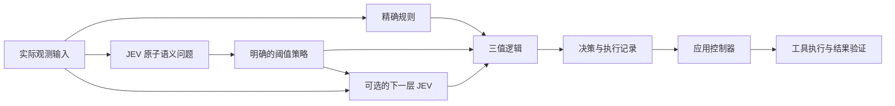

# jev-gates

[English](README.md) · [繁體中文](README.zh-TW.md) · **简体中文** · [日本語](README.ja.md) · [한국어](README.ko.md) · [Español](README.es.md) · [Français](README.fr.md) · [Deutsch](README.de.md) · [Português (Brasil)](README.pt-BR.md)

**把小型语义判断组合成逻辑门，再构建更复杂的决策电路。**

JEV 负责回答范围明确的问题；`jev-gates` 根据你设置的策略，把回答转换为 `TRUE`、`FALSE` 或 `UNKNOWN`，再用程序逻辑连接这些信号。你可以用 JSON 定义电路，在更大的电路中复用它，也可以把前一层的信号传给下一层 JEV。

[电路格式](docs/circuits.md) · [架构](docs/architecture.md) · [评估指南](docs/evaluation.md)

链接中的详细技术文档目前使用英文。

版本 0.1.0。TypeScript、Node.js 22 及以上、无运行时依赖、MIT 许可证。本项目独立开发，非 TypeSafe AI 官方项目，也未获得其背书。目前可以从源码运行，以下指令不要求项目已发布到 npm。



## 运行离线示例

克隆仓库后执行；如果已有本地副本，可以从 `npm install` 开始：

```sh
git clone https://github.com/carlchou0dailyfresh/jev-gates.git
cd jev-gates
npm install
npm test
npm run demo
```

示例使用**手写的模拟回答**，不会发送推理请求，预期返回 `priority_queue: TRUE`。它演示以下电路：

```text
enterprise AND (urgent OR billing) AND NOT abuse
```

`enterprise` 精确比较客户等级字段；`urgent`、`billing`、`abuse` 分别判断紧急性、账务问题及辱骂威胁。输出只是一项建议，不会发送消息或修改客服队列。

```sh
node dist/cli.js validate examples/support-triage.json
node dist/cli.js graph examples/support-triage.json
node dist/cli.js run examples/layered-review.json \
  --input examples/layered-input.json \
  --mock examples/layered-answers.json \
  --trace /tmp/jev-layered-trace.json
```

分层示例先评估影响程度、选择问题类别，再结合精确的资格条件。候选条件通过后，第二个语义节点会读取原始消息和前面的两个信号。这展示了多个语义层如何协作。

## 连接模型服务

必须明确选择 `--mock` 或网络服务提供者。CLI 不会在本地推理失败后自动切换到云端。

```sh
# 需要单独运行的 LocalJev 服务。
node dist/cli.js run examples/support-triage.json \
  --input examples/support-input.json \
  --provider localjev --base-url http://127.0.0.1:8080

# 运行前在环境变量中设置 TYPESAFE_API_KEY。
node dist/cli.js run examples/support-triage.json \
  --input examples/support-input.json \
  --provider typesafe --model jev-1.13.0
```

TypeSafe 适配器使用[带类型的 JEV API](https://docs.typesafe.ai/api)。JEV 接收文本和结构化文本数据，不能查看截图或操作鼠标。请先通过自己的工具获取所需观察结果，详见[模型文档](https://docs.typesafe.ai/models)。

[LocalJev](https://github.com/githubnext/localjev) 将这个协议连接到其他模型，概率由该模型生成。请分别校准和评估 LocalJev 与云端 JEV；更换后端可能改变判断结果和成本。

## 作为库使用

先运行 `npm run build`，再从仓库根目录运行以下 JavaScript：

```js
import { readFile } from 'node:fs/promises';
import { MockProvider, runCircuit } from './dist/index.js';

const readJson = async (path) => JSON.parse(await readFile(path, 'utf8'));
const circuit = await readJson('examples/support-triage.json');
const input = await readJson('examples/support-input.json');
const answers = await readJson('examples/support-answers.json');

const result = await runCircuit(circuit, input, {
  provider: new MockProvider(answers),
  maxCalls: 16,
  timeoutMs: 30_000,
});

console.log(result.outputs.priority_queue.truth);
```

替换为 `new TypeSafeProvider({ apiKey, model })` 或 `new LocalJevProvider({ baseUrl })` 即可明确启用实际推理。你也可以实现导出的 `Provider` 接口，接入其他兼容后端。`validateCircuit()` 检查电路结构，`toMermaid()` 生成电路图，`mountCircuit(prefix, circuit)` 为可复用子电路的节点和输出添加命名空间。

## 逻辑门与不确定性

| 节点 | 用途 |
| --- | --- |
| `semantic` | 按明确策略转换 `noul`、`choice` 或 `score` 回答 |
| `rule` | 精确比较实际输入字段，不调用模型 |
| `logic` | `and`、`or`、`not`、`nand`、`nor`、`xor` 或 `kofn` |
| `constant` | 提供固定的三值信号 |

阈值之间留有不作判断的区间。例如，Noul 策略设为 `falseAt: 0.2`、`trueAt: 0.8`，两者之间的值会产生 `UNKNOWN`。这些数字仅用于演示，不是经过实测的质量保证。Choice 策略必须把所有标签明确分配到 true、false、unknown 三组。

`UNKNOWN` 不等于假。`NOT UNKNOWN = UNKNOWN`；`FALSE AND UNKNOWN = FALSE`；`TRUE OR UNKNOWN = TRUE`。缺失输入、响应格式错误、超时或调用预算耗尽，都会产生未知信号。设置 `when` 的语义节点只有在条件为真时才执行，否则会被跳过，并输出带有原因的未知信号。context 中含有未知信号时，也会放弃本次判断。

引擎不会将多个概率相乘，虚构整个电路的置信度。相关问题可能重复同一个错误；堆叠更多层并不保证更准确。在为真实数据设置阈值前，请阅读[评估指南](docs/evaluation.md)。

## 接入控制器

规划、判断、操作和验证由不同部分负责。电路输出建议性判断和执行记录；应用代码确定允许执行的操作，调用工具，并在声明成功前验证实际结果。参见[架构说明](docs/architecture.md)与[控制器示例](examples/controller.mjs)。

```sh
node examples/controller.mjs
```

这个本地模拟会写入 CSV、验证内容并保存检查点，不会导出真实业务报表。

使用模拟回答的测试和示例不需要凭据。网络调用会把选中的观察结果和 context 发送给配置的服务。分享执行记录前请检查其中的内容；哈希不等于匿名化。详见[安全说明](SECURITY.md)。

## 参与贡献

请阅读 [CONTRIBUTING.md](CONTRIBUTING.md)。CI 在 Node.js 22、24 上执行测试与打包检查，不调用真实模型。真实模型质量、本地服务可用性以及外部工具行为都需要单独验证。

采用 [MIT 许可证](LICENSE)。
