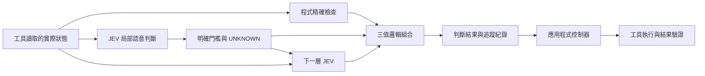

# jev-gates

**把小型語意判斷組成邏輯閘，再堆疊成更複雜的決策電路。**

JEV 負責回答範圍明確的小問題；`jev-gates` 依照你設定的政策，把回答轉成 `TRUE`、`FALSE`、`UNKNOWN`，再交給程式組合。你可以用 JSON 定義電路、重用子電路，也可以把前一層的訊號傳給下一層 JEV。

[English](README.md) · [電路格式](docs/circuits.md) · [架構](docs/architecture.md) · [評估方法](docs/evaluation.md)

版本 0.1.0。TypeScript、Node.js 22 以上、沒有執行期套件依賴、MIT 授權。本專案獨立開發，非 TypeSafe AI 官方專案，也未取得其背書。目前可直接從原始碼執行，以下指令不假設已發布到 npm。



## 先跑離線範例

下載專案後執行；已有本地專案時，可以直接從 `npm install` 開始：

```sh
git clone https://github.com/carlchou0dailyfresh/jev-gates.git
cd jev-gates
npm install
npm test
npm run demo
```

範例使用**手寫的模擬回答**，不會呼叫模型。預期 `priority_queue` 為 `TRUE`，展示以下電路：

```text
企業客戶 AND（緊急 OR 帳務問題）AND NOT 辱罵威脅
```

客戶等級由程式比較實際欄位；其餘三個條件交給語意閘。輸出只是建議，不會自動寄信或修改客服佇列。

```sh
node dist/cli.js validate examples/support-triage.json
node dist/cli.js graph examples/support-triage.json
node dist/cli.js run examples/layered-review.json \
  --input examples/layered-input.json \
  --mock examples/layered-answers.json \
  --trace /tmp/jev-layered-trace.json
```

第二個範例先評估影響程度、分類問題，再結合精確資格條件。候選條件成立後，下一層 JEV 會同時讀取原始訊息與前面的判斷。這示範了真正的語意堆疊。

## 接上 JEV 或 LocalJev

必須明確指定模擬回答或模型提供者。CLI 不會在本地服務失敗時偷偷改用雲端。

```sh
# 先自行啟動 LocalJev 服務。
node dist/cli.js run examples/support-triage.json \
  --input examples/support-input.json \
  --provider localjev --base-url http://127.0.0.1:8080

# 先在環境變數設定 TYPESAFE_API_KEY。
node dist/cli.js run examples/support-triage.json \
  --input examples/support-input.json \
  --provider typesafe --model jev-1.13.0
```

TypeSafe 介接使用 [JEV API](https://docs.typesafe.ai/api)。JEV 接收文字或結構化文字資料，不能直接看截圖或操作滑鼠；畫面觀察要先由工具取得。詳見[模型文件](https://docs.typesafe.ai/models)。

[LocalJev](https://github.com/githubnext/localjev) 用其他模型提供相容介面，其機率由模型生成。請分開測試 LocalJev 與官方 JEV 的校準、品質及延遲，不能直接沿用另一個模型的門檻。

## 當成程式庫使用

先執行 `npm run build`，再從專案根目錄執行以下 JavaScript：

```js
import { readFile } from 'node:fs/promises';
import { MockProvider, runCircuit } from './dist/index.js';

const readJson = async (path) => JSON.parse(await readFile(path, 'utf8'));
const result = await runCircuit(
  await readJson('examples/support-triage.json'),
  await readJson('examples/support-input.json'),
  {
    provider: new MockProvider(await readJson('examples/support-answers.json')),
    maxCalls: 16,
    timeoutMs: 30_000,
  },
);

console.log(result.outputs.priority_queue.truth);
```

把提供者換成 `TypeSafeProvider` 或 `LocalJevProvider` 就能明確啟用實際推論，也可以實作 `Provider` 介面。`validateCircuit()` 驗證電路，`toMermaid()` 產生電路圖，`mountCircuit(prefix, circuit)` 為子電路的節點與輸出加上命名空間，供較大電路重用。

## 可以組合哪些閘

| 節點 | 負責的事 |
| --- | --- |
| `semantic` | 依明確政策把 `noul`、`choice`、`score` 轉成三值訊號 |
| `rule` | 精確比較輸入欄位，不呼叫模型 |
| `logic` | `and`、`or`、`not`、`nand`、`nor`、`xor`、`kofn` |
| `constant` | 提供固定三值訊號 |

例如 Noul 門檻設為 `falseAt: 0.2`、`trueAt: 0.8`，中間的回答就是 `UNKNOWN`。這些數字只是示範，尚未用你的資料校準。Choice 的每個標籤都必須明確歸入 true、false 或 unknown 其中一組。

**不知道不等於否。** `NOT UNKNOWN = UNKNOWN`；`FALSE AND UNKNOWN = FALSE`；`TRUE OR UNKNOWN = TRUE`。缺少必要輸入、回傳格式錯誤、逾時或呼叫預算用完，都會留下未知訊號與原因。設定 `when` 的語意節點只有在條件為真時才執行，跳過後的訊號是未知。前一層 context 有未知訊號時，也會停止該次語意推論。

本專案不會把多個機率相乘，宣稱得到整個電路的可信度。同一個模型的多個判斷可能一起犯錯；堆疊更多層不保證更準確。請依[評估方法](docs/evaluation.md)測試完整電路。

## 接上工具與控制器

電路輸出判斷與紀錄。控制器保存進度、決定允許的動作、呼叫工具，再驗證檔案或其他實際結果。模型說「完成」不能取代驗證。參考[架構說明](docs/architecture.md)與[控制器範例](examples/controller.mjs)。

```sh
node examples/controller.mjs
```

這個本地模擬會寫入 CSV、驗證內容並保存執行狀態，沒有匯出真實業務報表。

使用模擬回答的測試不需要金鑰。實際推論會把選取的輸入與 context 傳給設定的服務；分享追蹤紀錄前請檢查內容，雜湊不等於匿名化。詳見 [SECURITY.md](SECURITY.md)。

歡迎依 [CONTRIBUTING.md](CONTRIBUTING.md) 提交修改。CI 在 Node.js 22、24 執行離線測試與套件檢查；真實模型品質與外部工具仍需另行驗證。採 [MIT 授權](LICENSE)。
