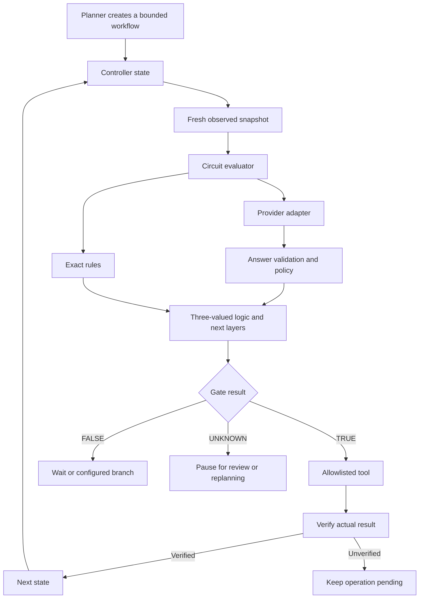

# Architecture and controller boundary

The project separates semantic interpretation from exact logic and side effects:

## Circuit evaluator

`runCircuit` validates and evaluates a DAG against one immutable input snapshot. The provider adapter speaks the typed question/answer protocol; policy conversion and composition happen in application code. The engine validates provider responses even when a custom provider is used.

All semantic context dependencies are explicit. Each later layer receives selected original evidence and the selected preceding signals. The graph cannot call tools, evaluate JavaScript expressions, or invent a new action. Cycles are rejected; repeated observation belongs to the controller.

Logical composition does not produce a joint probability. The output is a decision under a declared policy, with an explanation code and trace. A true semantic signal cannot establish that a file exists or that a payment actually settled.

## Controller

The exported `Controller` connects named gate evaluators to named tool adapters. Each nonterminal state declares `gate`, `tool`, and `next`, plus an optional `onFalse` branch. A `maxSteps` budget bounds evaluation attempts. Each `step(snapshot)` uses a fresh observation supplied by the application.

- `TRUE` allows the registered tool to run. Only `verify(...) === true` advances to the next state.
- `FALSE` waits or follows the configured nonterminal branch; it cannot complete a workflow.
- `UNKNOWN` or an evaluation error pauses for explicit review. `resumeAfterReview()` acknowledges that review before another attempt.
- Tool errors or failed verification leave a pending operation. `resolvePending(receipt)` checks external evidence without executing the action again.

An operation ID is created and persisted before tool execution. Pass it through to integrations that support idempotency. After a crash, investigate an outstanding operation and supply its actual receipt; the controller will not automatically replay it. This is not an exactly-once guarantee for external systems.

`FileCheckpointStore` provides a local checkpoint file. Checkpoints are bound to the controller definition; bump its version when external gate policies, tool semantics, or verification behavior changes. Use one writer per checkpoint path. Atomic file replacement does not provide multi-process locking or database transactions.

See [examples/controller.mjs](../examples/controller.mjs) for a runnable integration using a local artifact. This example does not automate a browser, export a real business report, or prove a hosted model's quality. Bring your own API or computer-use adapter and verify its actual outputs.

## Data and failure boundaries

Network providers receive the selected input and explicit context. The engine records answers and metadata without embedding the entire original input in a trace. Labels, question IDs, and answer text can still expose information; digests are not anonymization.

The default providers make bounded requests and do not automatically retry failures. A provider error becomes unknown, not false. Batch validation is conservative: an invalid response invalidates its request's signals. Exact logical evidence can still settle an output, such as `TRUE OR UNKNOWN`.

For production integration, define acceptable decisions, authorization, action idempotency, freshness, result verification, and recovery in your application. The library supplies composition and execution boundaries; it does not grant access to external systems.
