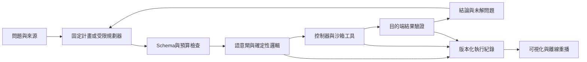

# 語意邏輯閘可視化研究工作台：完整開發任務

版本：1.0｜建立日期：2026-09-20｜狀態：開發任務規格，尚非產品完成報告

## 1. 目標與研究邊界

把 `carlchou0dailyfresh/jev-gates` 從語意電路函式庫，擴展成能實際操作的研究工作台：使用者提出問題、檢查或編輯有界計畫、觀看語意判斷與程式邏輯的組合、查看原始證據、修正條件、驗證動作結果，並保存及離線重播整次執行。

長期方向是研究更一般化的人工智能。第一版要量測六項能力：條件判斷、組合推理、跨情境遷移、有限步數規劃、根據新證據修正、從已驗證經驗重用子電路。將能力、泛化與自主程度分開記錄，參考 [Levels of AGI](https://arxiv.org/abs/2311.02462)；未見任務的學習與組合能力另參考 [On the Measure of Intelligence](https://arxiv.org/abs/1911.01547)。這些是研究設計依據，不是本專案已達 AGI 的證據。

交付必須是一個能啟動、能操作、能檢查結果的產品。情境跑通、mock 全過、多層判斷或漂亮動畫，都不構成 AGI 或真實模型準確率的證明。

## 2. 現況、延續工作與版本控制

- 專案：獨立開發 checkout；GitHub：<https://github.com/carlchou0dailyfresh/jev-gates>。
- 2026-09-20 核對：`main` 與 `feat/research-validation-round` 同為 `ee60004e949763c127ead40d38804aa52e5f805a`，原工作目錄乾淨。
- 已有：TypeScript 函式庫、CLI、三態邏輯、DAG 分層與批次、provider 回應驗證、逐節點 trace、子電路組合、Mermaid 匯出、controller 與 pending 操作復原。
- 缺口：尚無前端；沒有 `research:demo`、`verify-report` 與完整離線 replay；controller 的 evaluate／execute／verify 缺期限；沒有完整 run 總預算、版本化證據包或模型品質評測管線。
- 前一輪獨立 checkout 的 `npm ci` 與原版 49 項測試已通過。新任務仍須針對最終修改重新驗證。
- GitHub 連線已完成個人帳號的單倉庫授權，且 connector 寫入既有相同 blob 成功；這是連線證據，不是新程式已推送。
- 原對話的 19 檔 PATCH／ZIP 沒有取得。本任務獨立實作下列規格，不聲稱還原或套用了原附件；若後來拿到附件，先核對來源與差異，避免重複覆蓋。
- 使用獨立 worktree，從 `origin/feat/research-validation-round` 開始。保留使用者既有修改，不直接修改或合併到 `main`。完成後將已驗證結果正常推送至 `feat/research-validation-round`，建立或更新指向 `main` 的 PR；不 force-push。
- 推送前重查遠端 SHA；有新提交則先整合與測試，不覆蓋他人工作。

## 3. 產品架構與資料契約

迭代必須有明確的下一輪輸入與上限。每一輪仍是不可變快照上的 DAG；循環、重新觀察與重新規劃由 controller 管理。

保持核心函式庫、CLI、前端與本機執行服務分離。優先保留現有公開 API 與套件使用方式，新增前端不能迫使函式庫使用者安裝整套 UI。前端可用 React／TypeScript 與現行穩定的圖形元件，先讀官方文件、固定版本，再記錄選型。核心邏輯只保留一份，由 UI 和 CLI 共用。

建立並驗證以下版本化物件：

| 物件 | 必要內容與界線 |
| --- | --- |
| EvidenceRecord | sourceId、來源種類、URL或本機識別、取得時間、內容雜湊、引用位置、原文、適用範圍、新鮮度；區分 synthetic／public-source／user-provided |
| GateSpec | gateId與版本、單一問題、輸入 schema、引用來源、輸出型別、UNKNOWN 條件、policy、校準資料版本、範例與反例 |
| DecisionSignal | TRUE／FALSE／UNKNOWN、結構化 reason code、輸入與 policy digest、provider與實際模型、相關 evidenceId；不製造不存在的機率 |
| RunArtifact | schemaVersion、runId、parentRunId、電路與輸入、模型設定、逐次請求與回應、事件、預算、結果、錯誤與驗收狀態 |
| ActionRecord | operationId、目標與參數 digest、執行狀態、回執、查詢結果、外部驗證結果；不得只靠模型聲稱完成 |
| Assessment | labels與切分版本、適用資料、metrics、樣本數、是否獨立覆核、passed／failed／not_evaluated；與 workflow 狀態分開 |

不要把真值、執行狀態和資料來源混成一種顏色。`SKIPPED`、`RUNNING`、`TIMEOUT` 是執行資訊；UNKNOWN 的原因可能是資料不足、證據衝突、過期或模型棄答。最終真值仍保留既有三態語義。矛盾先以 metadata 和明確的 conflict policy 處理，不暗中修改所有既有閘的真值表。

## 4. 更精細的語意邏輯閘

保留 AND／OR／NOT／XOR／NAND／NOR／k-of-n 的既有語義，用真值表與屬性測試保護相容性。每個新增閘都交付型別、前置條件、真值／決策規則、失敗原因、可用證據與測試。

| 閘或模組 | 第一版行為 |
| --- | --- |
| Evidence required | 缺少必要來源或引用無法定位時棄答；引用文字存在不等於支持主張 |
| Claim support | 判斷原文對限定主張的支持、反駁、混合或不足，保留原文；不是來源真實性的判定 |
| Scope match | 分別檢查任務、對象、條件與指標適用性，防止限定結果被擴大 |
| Conflict handling | 把互相支持與反駁的證據並列，依版本化 policy 棄答或要求補資料 |
| Freshness | 用程式比較明確時間、有效期限與版本；不讓模型估算日期 |
| Constraint／veto | 用程式驗證精確限制；明確否決條件具有記錄在案的優先順序 |
| Uncertainty routing | 按節點、provider、模型、語言與場景使用各自 policy，不設一條全域萬用分數線 |
| Counterexample | 為候選結論尋找可檢查反例；找不到反例不等於證明成立 |
| Coverage check | 檢查指定研究面向與必要條件是否有節點；僅為結構覆蓋，不宣稱找齊所有重要因素 |
| Temporal condition | 對有時間戳的多次觀察明確定義窗口、缺測及 stale 規則；使用受控狀態契約 |
| Reusable subcircuit | 子電路有輸入／輸出契約、命名空間、版本與測試；修改產生新版本 |

JEV 負責有界的語意問題，程式負責精確邏輯、數字、權限、執行與驗證。這符合 TypeSafe 的原子問題與程式組合方式。[TypeSafe Introduction](https://docs.typesafe.ai/introduction)

保留 Noul、Choice、Score 各自的原始數值與政策；不能混成同一種 confidence，也不能把相關節點的機率相乘後稱為端到端正確率。門檻須有資料支持。[TypeSafe Confidence](https://docs.typesafe.ai/confidence)

LocalJev 要顯示 bridge 與實際上游模型。其自行生成的分布與 hosted JEV 的結果分開校準、分開報告；協定相容不表示數值意義相同。[LocalJev 原始專案](https://github.com/githubnext/localjev)

## 5. 可視化工作台與互動驗收

介面以繁體中文呈現，術語附簡短說明。採研究儀器的資訊結構：問題、證據、判斷與下一步行動清楚可找。開發時讀取 `ui-skills-root`，選擇符合此工作台的最少技能。

| 畫面 | 必須可以完成的操作 |
| --- | --- |
| 情境入口 | 選擇案例、預期學到什麼、輸入與限制、fixture／錄製重播／live 模式；一鍵開啟可運作案例 |
| 電路工作台 | 顯示或編輯 DAG、增加／刪除／連接節點、放大與自動布局、子電路折疊、節點搜尋；無效連線立即解釋 |
| 節點檢視器 | 查看題目、選取的原文、分布、policy／閾值、真值與原因、上游影響；顯示可觀察決策摘要，不虛構模型內部思考 |
| 執行時間軸 | 執行、取消、查看已完成步驟；離線模式可前進／後退／播放。live 模式不能暗示倒退會撤銷已執行工具 |
| 證據與主張 | 原文定位、支持／反駁並列、來源時間與版本、缺失條件、未解問題；顯示需要補什麼 |
| 比較與評測 | 原方案與修改後分支並排；顯示變更節點、結論、棄答、成本與延遲；資料量不足就直接標示 |
| 執行庫 | 搜尋 run、匯入／匯出版本化紀錄、驗證完整性、離線重播、操作 pending 查詢與處理 |

互動要求：

1. 修改 policy、來源或人工判定時建立子 run，保留原紀錄、修改原因與來源；人工覆核不能改寫歷史模型輸出。
2. 點擊 UNKNOWN 能直接看到原因與建議補充資料；區分沒執行與執行失敗。
3. UI 消費真實核心事件，不能用計時器假裝模型正在推理。動畫尊重 reduced motion。
4. 360／768／1440px 檢查；手機提供排序節點清單與分頁檢視器，不依賴縮小大畫布。編輯與查看都有鍵盤替代操作、可見焦點與螢幕閱讀標籤，真值不能只靠顏色表示。觸控目標至少 44×44px，關閉抽屜後焦點回到來源控制項。
5. 建立 20／100／256 節點 fixture 測量互動與渲染，記錄設備及耗時；不以降低引擎驗證換取畫面流暢。
6. 空白、loading、錯誤、取消、模型未設定、資料不足與匯入損壞都有可理解的畫面；無服務時仍可完成離線範例。

## 6. 四個可操作的情境展示

每個案例至少有正常、缺失、反例／衝突、故障四種路徑，附操作腳本與預期結果。案例完全獨立於 DailyFresh 業務資料。

### A. 長上下文能否取代 RAG：有條件的研究結論

使用者選擇任務、上下文長度、成本限制與可用證據；系統拆出有限主張，檢查引用與適用範圍，展示來源如何支持或限制結論。加入相反證據後，能看見哪些節點改變及哪些主張仍未知。

先提供六個主張的 synthetic fixture，明確標示所有合成測量；另建立獨立的真實公開文獻模式，保存可追溯來源、版本與引用。沒有獨立標籤時 assessment 必須是 not_evaluated。Demo 不得把不同論文的設定直接合併成優勝排名。

驗收：至少一個限定成立、一個明確反駁、一個資料不足案例；改變適用條件會產生合理且可追溯的結論差異；export→verify→offline replay 一致。

### B. 軟體服務事故診斷：觀察、假說與修復回執

虛構服務提供日誌、指標、部署事件與故障注入。比較資料庫連線耗盡、設定變更和上游故障等競爭假說；使用者可注入過期指標或相反證據，選擇沙箱診斷動作。

僅操作本機模擬服務。一次「修復請求逾時、服務其實已修復」的案例，必須保持 pending，查詢目的端狀態後才結束，不能重送動作。

驗收：模型判定、工具執行與健康檢查三者分開展示；驗證失敗不得顯示已解決；重新載入或重複復原不造成第二次操作。

### C. 多限制任務規劃：規則改變後重新規劃

虛構探測站有能源、時間、儀器與先後依賴。LLM 可提出計畫，JEV 判讀任務描述，精確可行性與資源核對交給程式。使用者中途關閉儀器或降低能源，觀察受影響的節點與替代計畫。

驗收：用獨立的確定性求解器檢查可行性與完成條件；無解時明確表示限制衝突，不能編造資源；重規劃保留舊計畫與變更原因。

### D. 未見規則的迷你世界：測試有限範圍的泛化

生成小型文字世界，定義物件、轉換、先決條件與觀察遮蔽；先給有限示例，再測未見組合、改名、干擾資訊、矛盾規則與新規則家族。畫面展示狀態轉移、可用子電路、錯誤反例與修正前後差異。

訓練／開發／校準／測試按規則家族和生成器版本隔離，不能只換亂數種子就宣稱新任務。預期答案由獨立執行器產生，不能讓規劃器看到評測答案。

驗收：可固定種子重現同一案例；正式測試前凍結政策；報告零示例／少示例表現、學習效率與失敗分布。新規則候選先在開發集驗證，再版本化納入子電路庫；不在測試過程偷偷改答案或在線改核心程式。

## 7. 可靠執行、重播與真實評測

### 執行與持久化

- 增加整次 run 的總時間、呼叫數、節點／步數及可計量的 token／cost 帳本。未知用量標記 unknown，不宣稱已精準控制花費。預算耗盡停止新呼叫並保存局部結果。
- 為 gate、tool、verify 分別設期限與 AbortSignal。取消不代表目的端動作已撤銷；逾時與遲到結果要能調解。
- 操作前持久化 operationId、目標、輸入與 policy digest。adapter 要有目的端冪等或查詢方案；落實單 writer 或鎖定，不宣稱外部 exactly-once。
- 原始 provider 回應與使用者來源保留於本機可控制位置；金鑰只在服務端，不能寫入前端、trace、Git 或分享檔。預設本機 loopback，匯入內容不得執行 JS 或任意命令。
- 規劃器輸出受 schema、工具清單、證據引用、覆蓋範圍與預算約束。文件中的指令只是資料，不能擴大工具權限。

### 重播與誠實標示

- 提供 `verify-report` 與 `replay`，把輸入、policy、電路、請求／回應及摘要的關聯一起驗證。
- 在禁止網路、禁止真實工具動作的條件下重算邏輯結果。重播中的工具部分只能展示既存事件與回執，不能再次呼叫動作。
- 每次執行可分辨：fixture、recorded-live、live-localjev、live-typesafe；混用時逐節點顯示 provenance，不能只貼一個全域 live 標籤。
- 輸入來源 synthetic／source-backed、提供者 fixture／LocalJev／TypeSafe、工具 sandbox／live 分成三個欄位記錄與顯示。live 模型讀合成資料，仍是合成情境。
- workflow completed 表示流程及檔案處理完成；assessment passed 需要符合獨立定義的驗收；無標籤就是 not_evaluated。API 故障導致 UNKNOWN 不能因答案也剛好未知而算成功。
- 雜湊證明內容一致性，不能證明來源真實、作者身分或科學結論。

### 評測與通過標準

確定性工程測試是硬性門檻：既有回歸、真值表、DAG schema、預算停止、controller 復原、artifact 竄改拒絕、離線零外呼和 UI 資料一致性全部通過。

模型品質另列實驗結果。先建立可執行的資料 manifest、標籤來源、分組切分、校準程序與同場比較，再跑模型。首輪預設每個案例準備至少 12 個離線端到端變體；迷你世界提供至少 120 個保留案例和規則家族切分檢查。這些數量是工程試驗起點，不構成充分統計證據。

比較組：單次 LLM、原子語意判斷＋程式、固定分層電路、受限規劃器＋電路；可用同一 provider 時控制模型、資料、工具與預算。拿掉第二層、記憶或反例模組做消融。不可只用新整套系統對比舊的弱基線。

報告 FP／FN、正確已知結果、coverage、棄答與故障原因、工具成功率、約束違反、總成本、P50／P95 延遲、樣本數與適合的信賴區間。依 provider／模型／語言／場景分層；可用分布才計算 Brier／NLL／可靠度圖。

首次模型驗證優先使用現有已授權本機服務，記錄實際模型與可重現的一次推論；服務 status 不算推論成功。先做小批 smoke，再按有界設定擴大。TypeSafe 沒有可用金鑰就保留 not_run，不捏造結果、不反覆索要金鑰，也不自動改走雲端。雲端大批付費評測需先有明確的費用上限。

品質目標、最低 coverage 與容許錯誤率須在 held-out 執行前寫入 eval protocol，並說明樣本與用途。未達標即標示 experimental／failed，交付誠實的失敗報告；不得以改測試集或降低條件製造通過。模型品質尚未證實時，工程工作台仍可交付，但不能標示已驗證通用智能。

## 8. 里程碑、依賴與完成定義

以下是實作順序，不是假定人力或工期的承諾。任務建立後應直接進行 P0 和 P1，不停留在重新提案。

| 階段 | 工作包與成果 | 完成證據 |
| --- | --- | --- |
| P0 基線與契約 | 檢查 worktree、現有 API、依賴、provider；建立架構決策、schema、任務看板、評測協議草稿 | 基線測試、gap ledger、版本控制與資料契約 |
| P1 第一條完整流程 | RunArtifact／事件、verify／replay、總預算、controller 期限；研究案例 fixture；可啟動工作台、圖與節點 inspector | 一次 UI 執行→匯出→禁止網路重播；瀏覽器操作紀錄 |
| P2 精細閘與四情境 | 證據、衝突、新鮮度、限制、時間與子電路；案例 B／C／D；編輯、分支比較、操作復原 | 每案例四種路徑、跨核心與 UI 測試、無重複動作證據 |
| P3 真實模型與泛化 | provider provenance、現有本機 live smoke、可重現資料切分、校準、比較與消融、泛化迷你世界 | live 原始回應／模型版本、metrics、未執行項與失敗完整列出 |
| P4 打磨與交付 | 可及性、響應式、效能、資料匯入邊界、套件相容性、操作與研究文件 | CI、瀏覽器驗證、可啟動預覽、branch／SHA／PR與限制清單 |

關鍵依賴：P0 的 schema → P1 核心事件與執行包 → UI 與情境；證據模型 → 校準／評測；controller 期限與復原 → 有動作的沙箱案例。前端與資料集可在契約固定後並行，避免兩份狀態計算。

交付物：

1. 可安裝的核心函式庫與 CLI，以及一個有文件說明的本機啟動指令；在乾淨環境依 README 能運行。
2. 可視化工作台、四個情境及至少一份已驗證的執行包；固定種子的離線 demo 可反覆運作。
3. 版本化 Gate／Evidence／Run／Assessment schema、閘門目錄、controller 與 adapter 契約。
4. 研究問題→受限計畫→語意判斷→確定性組合→結果驗證→報告→離線 replay 的完整管線。
5. 可執行的評測與消融工具、資料 manifest、校準及 held-out 報告；真實模型項目能完成多少就據實標示，絕不以 fixture 替代。
6. 架構與操作文件、案例導覽、來源與授權資訊、資料／金鑰處理說明、已知限制及後續研究清單。
7. 完整驗證過的 commit、指定分支、指向 main 的 PR；PR 明示 fixture/mock 不代表真實 JEV 準確率，並分開列出本機、CI、live 模型與瀏覽器證據。

最終報告要同時列出已完成、實驗未通過、未執行與外部阻塞；附可開啟介面、啟動方式、branch、SHA、PR URL。只有在實際證據支持時才說能力提升；不要以「完成 AGI」作交付結論。
